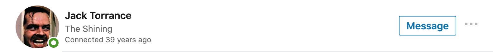
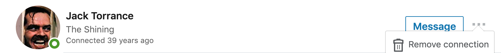
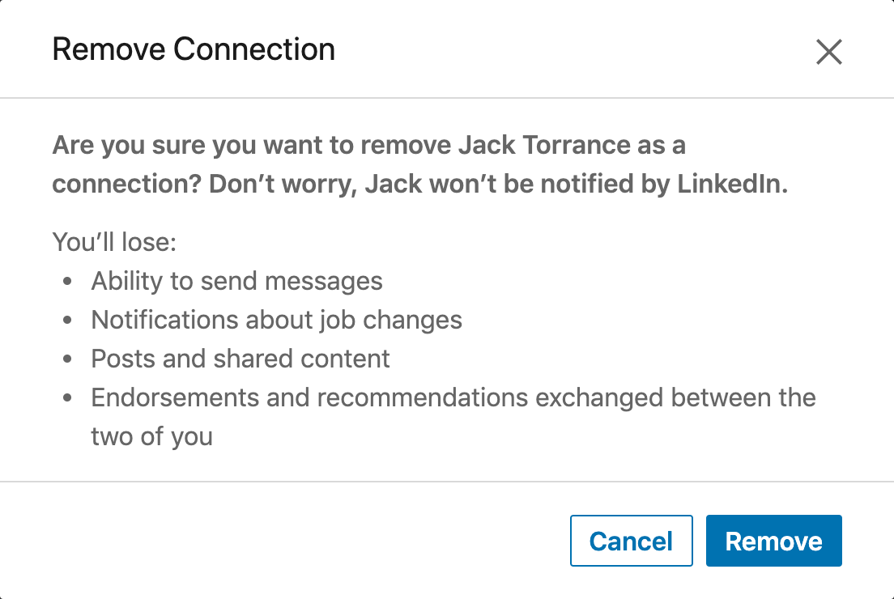
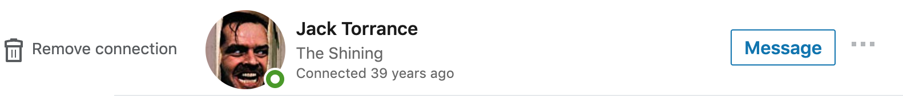

# LinkedIn One-Click "Remover"

## Usage
Paste content of [index.js](index.js) to Dev Tools' Console.

## How does it work?

### Before (3 Clicks)
0. Click ellipsis
  

0. Click "Remove connection"
  

0. Click "Remove"
  

### After (1 Click)

0. Click "Remove connection"
  

## Protip
Did you know that you can easily capture screenshot of the HTML Element using
**Capture node screenshot** from Chrome Dev Tools' Command Menu?  

On Mac OS click:  
0. `F12` to open Dev Tools  
0. `⌘ Command` + `⇧ Shift` + `C` to select element
0. `⌘ Command` + `⇧ Shift` + `P` to open Command Menu

and start typing "node screenshot"

